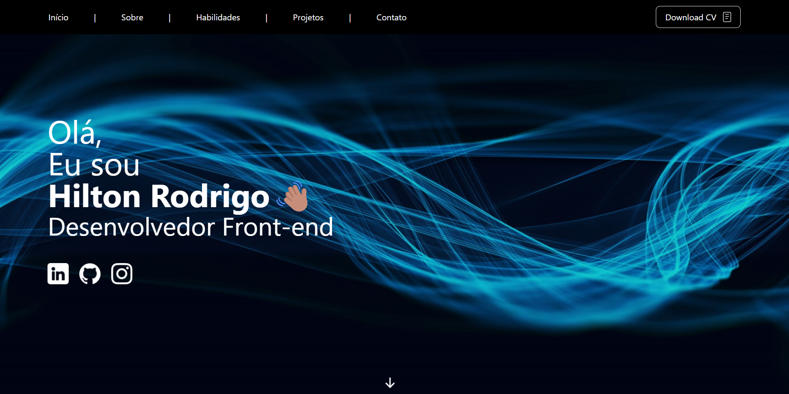

# Portfolio - Hilton Rodrigo

  

## 📑 Description

This is the most recent and updated version of my portfolio!

## 🔗 Functions

This project consists of a page with a responsive layout, where people will be able to see my main projects developed!

## 💻 Language and Tools

For the development of this project, the following languages and tools were used:

- [React](https://react.dev/)
- [Next.js](https://nextjs.org/)
- [Tailwind CSS](https://tailwindcss.com/)
- [TypeScript](https://www.typescriptlang.org/)
- [Tabler-Icons](https://tabler-icons.io/)

## 🚀 Deploy

Click on the link below to access the project 👇🏾

- [Portfolio - Hilton Rodrigo](https://my-portfolio-hrodrigomota.vercel.app/)